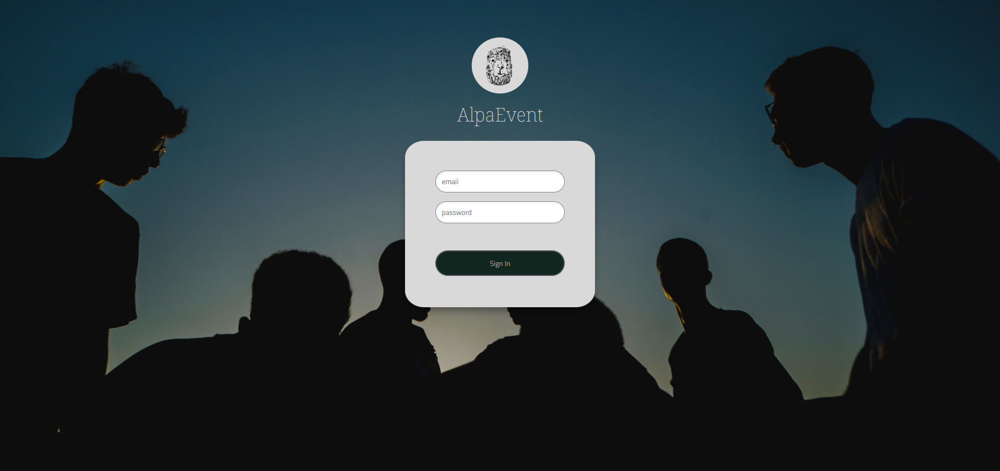
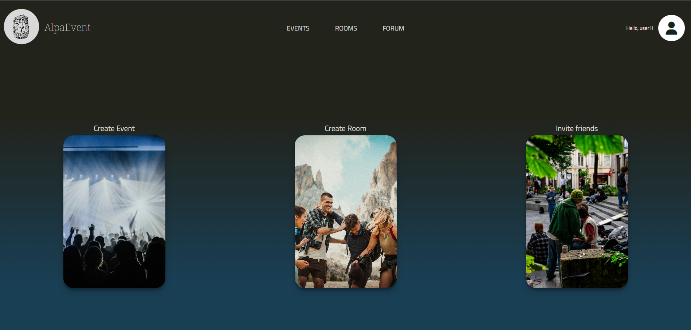
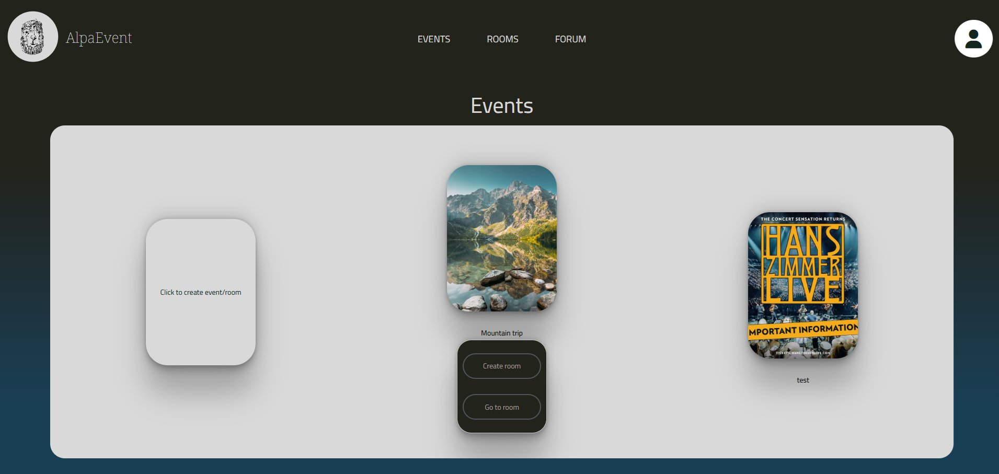
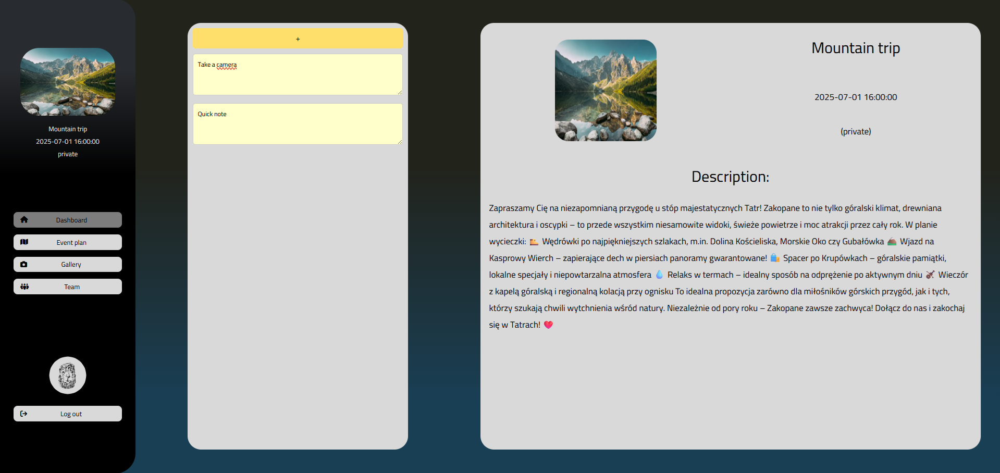
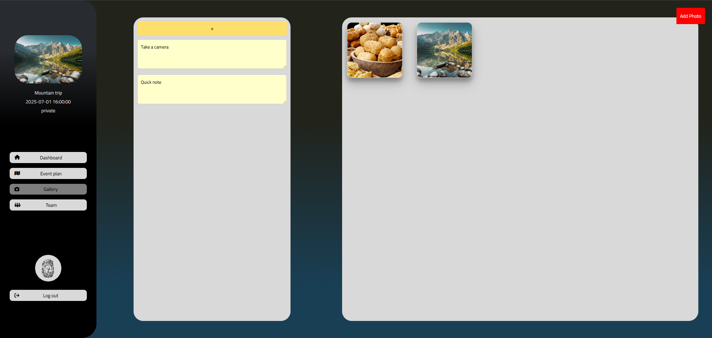
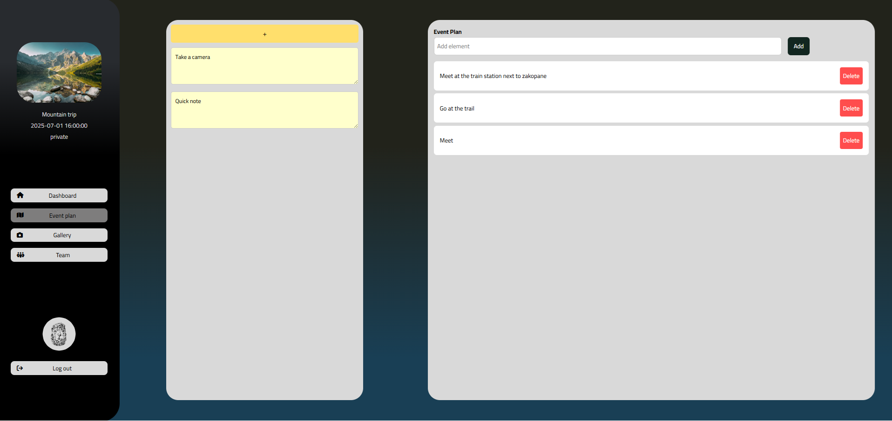
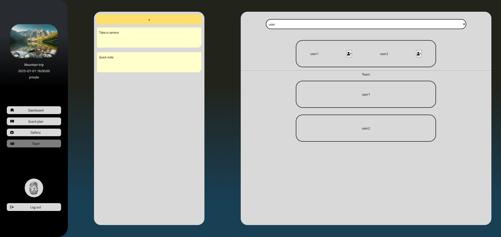

# 🎉 AlpaEvent

**AlpaEvent** is a web-based event management app that helps users create events, organize rooms, collaborate with friends, and share resources like photos and sticky notes.

---
### 👥 User System
- Secure login & registration (password hashing with `bcrypt`)
- Profile editing (username, email, password)
- Account deletion with confirmation
- Friend search and connection system

### 📅 Events & Rooms
- Create events with name, type, date, location, and description
- Assign users to rooms connected to events
- View event information per room
- Room-specific modules like chat, gallery, event plan and sticky notes

### 🗒️ Sticky Notes
- Add & edit quick notes in each room
- Asynchronous (AJAX-based) save/load
- Notes are persisted in the database

### 🖼️ Gallery
- Upload and preview room-related photos
- Responsive grid gallery with full-screen preview

### 🧾 Future Modules
- Event Settlements (expense tracking)
- Task/plan management with prioritization strategies
- Realtime chat system (WebSockets)

---

## 🛠 Tech Stack

| Layer     | Tech                          |
|-----------|-------------------------------|
| Backend   | PHP 8 (Custom MVC structure)  |
| Frontend  | HTML, CSS, JavaScript (vanilla) |
| Database  | PostgreSQL (Dockerized)       |
| Tools     | Composer, Docker, dotenv      |
| Auth      | PHP native sessions, bcrypt   |

---

## 📊 Database Structure

---

## 🔐 Login

---

## 🏠 Home Page

---

## 📅 Events List

---

## 📊 Room Dashboard

---

## 🖼️ Gallery View

---

## 🧩 Plan Management

---

## 👥 Team View

